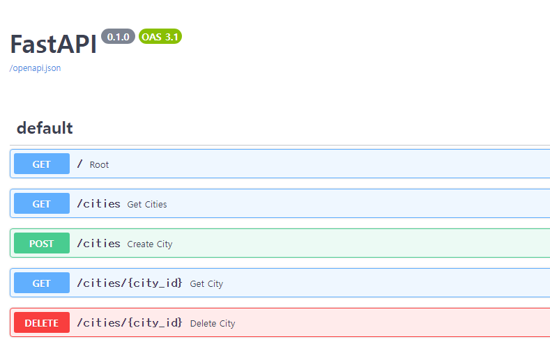
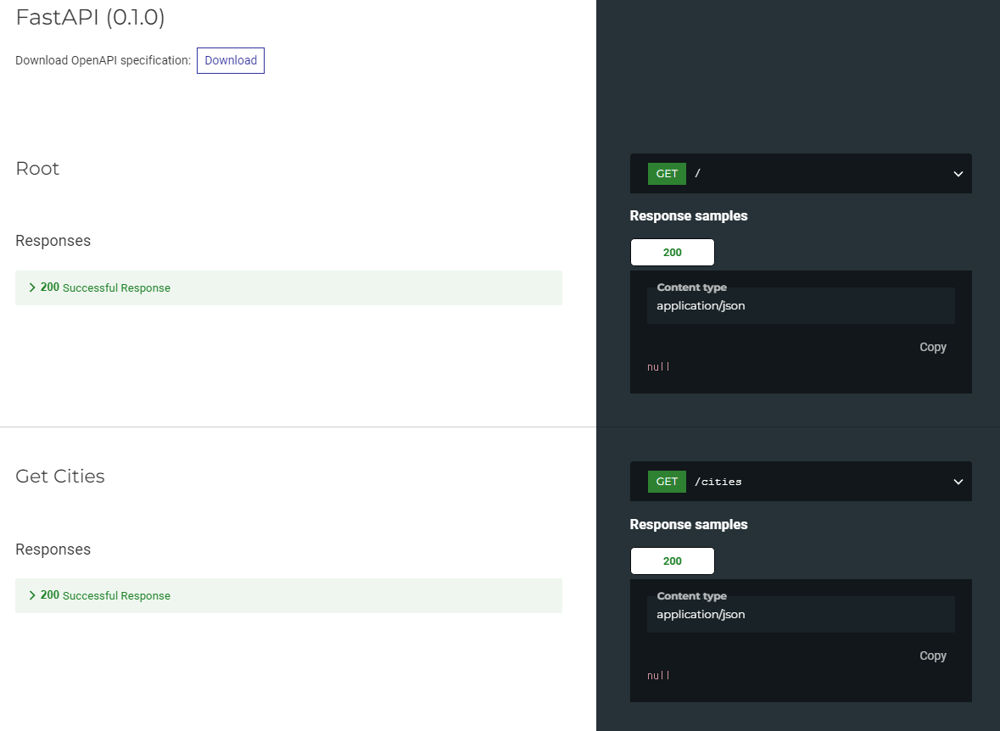
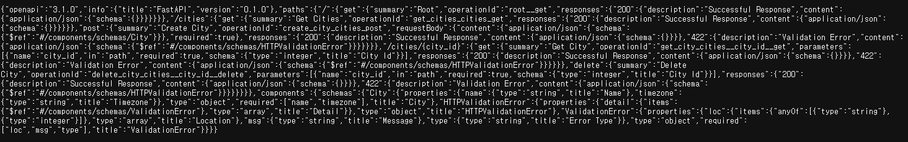
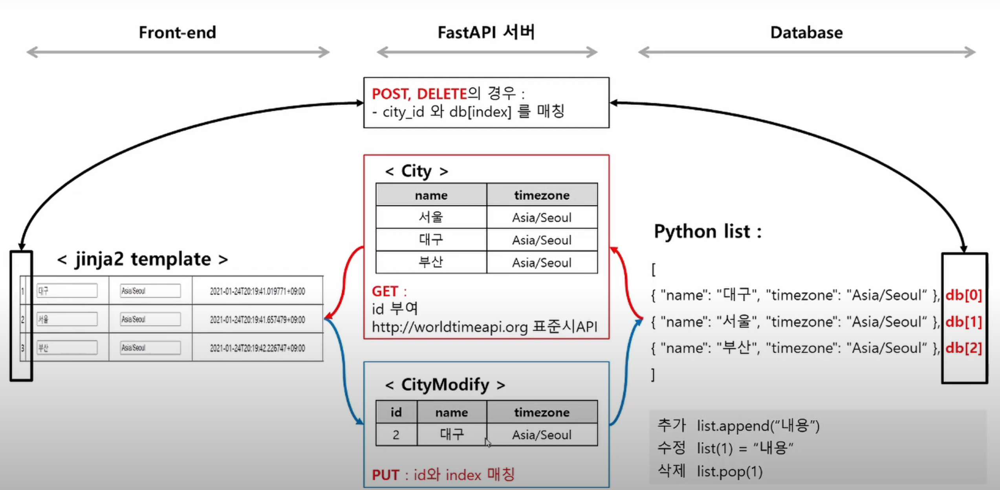

# FastAPI

## python 가상환경에서 설치 및 띄워보기
```python
pip install fastapi
pip install uvicorn
pip intstall hypercorn
# 띄우기
python -m uvicorn main:app --reload
```
### uvicorn이란?
* Python으로 작성된 고성능 비동기 웹 서버
* ASGI (Asynchronous Server Gateway Interface) 프레임워크를 사용하여 비동기 웹 애플리케이션을 처리
* 가벼우면서도 높은 성능을 제공

### fasr api에서 uvicorn을 왜 사용해?
* FastAPI는 ASGI(Asynchronous Server Gateway Interface)를 사용하여 비동기 웹 애플리케이션을 구축하는 데 중점을 둔 웹 프레임워크
* Uvicorn은 비동기 처리를 지원하여 대용량 트래픽을 처리할 때 높은 성능을 제공
* FastAPI는 ASGI를 기반으로 구축되었으며, Uvicorn도 ASGI를 지원
* FastAPI는 비동기 코드 작성을 지원하며, Uvicorn은 이를 효율적으로 실행

## FastAPI 기본 서비스
### Swagger
```localhost:8000/docs```
> API를 문서화하고 테스트하기 위한 도구


### ReDoc 
```localhost:8000/redoc```
> 좀 더 깔끔한 UI로 API 문서를 제공하고 싶은 경우에 사용


### openapi.json
```localhost:8000/openapi.json```
> API의 설명서를 정의하는 JSON 파일


## fastAPI기초(3/5)


### template 띄우기
```python
✅ 1. 설치
#템플릿을 렌더링하기 위해 Jinja2 템플릿 엔진을 사용
pip install jinja2

✅ 2. 템플릿 파일이 위치한 디렉토리를 지정
templates = Jinja2Templates(directory="templates")

✅ 3. 응답으로 html을 보내기 위해 HTMLResponse로 지정
@app.get('/cities/{city_id}', response_class=HTMLResponse)
def get_city(request: Request, city_id: int):
    city = db[city_id-1]
    r = requests.get(f"http://worldtimeapi.org/api/timezone/{city['timezone']}")
    cur_time = r.json()['datetime']

    context = {'request':request, 'name':city['name'], 'timezone':city['timezone'], 'current_time': cur_time}

    ✅ 4. TemplateResponse를 사용하여 
          'city_list.html' 템플릿 파일을 렌더링하고, context를 전달
          
    return templates.TemplateResponse("city_detail.html", context)
```

```
오류난 부분
html에서 도시 이름과 Asia/Seoul 등록하면
undefined - undefined added
422 Unprocessable Entity 에러 발생
-> xhr.setRequestHeader("Content-Type","application/json"); 코드 추가
   기본값은 Content-Type: text/plain;charset=UTF-8
```